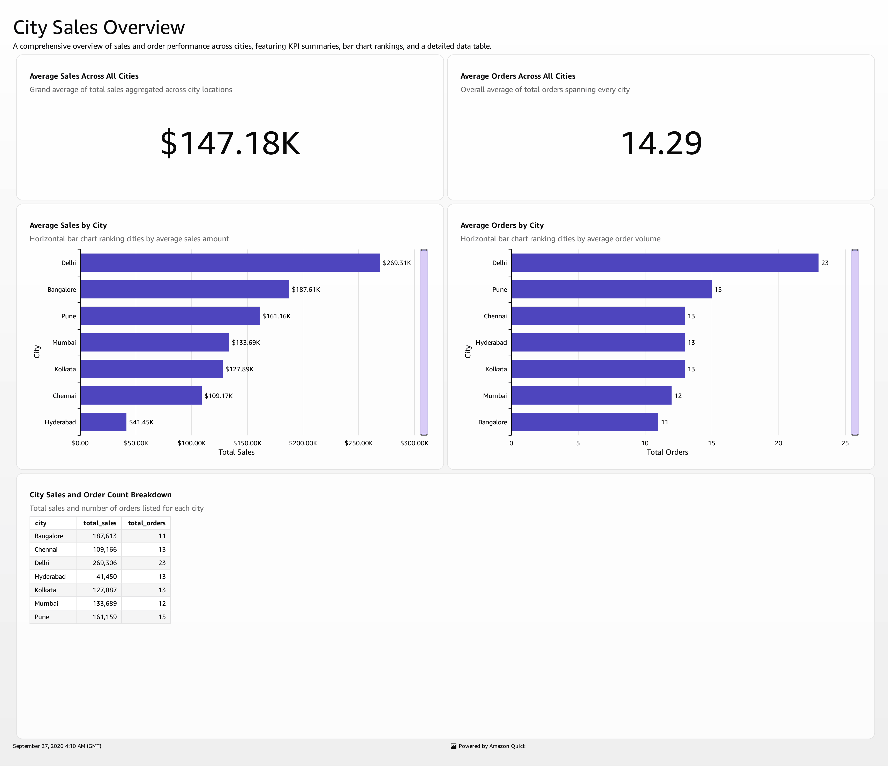

# AWS Real-Time E-commerce Analytics Platform

A Serverless Data Engineering Project using Medallion Architecture (Bronze-Silver-Gold) with AWS.

## 📌 Architecture Diagram

## 🏗️ Architecture Flow
1.  **Ingestion Layer:** S3 Raw Bucket (CSV Files) -> Lambda (CSV Parser & Validator) -> Kinesis Data Stream
2.  **Bronze Layer:** Kinesis Firehose -> S3 Bronze (Raw JSON, Partitioned by Date/Hour)
3.  **Silver Layer:** AWS Glue ETL Job (Bronze to Silver) -> Data Cleaning, Deduplication, Standardization -> S3 Silver (Orders, Products in Parquet)
4.  **Gold Layer:** AWS Glue ETL Job (Silver to Gold) -> Business Aggregations (City-wise, Product-wise) -> S3 Gold
5.  **Warehouse & BI Layer:** S3 Gold -> COPY to Amazon Redshift (Data Warehouse) -> Athena (Ad-hoc SQL Queries) -> QuickSight (Dashboards)

## 🛠️ Tech Stack
- **Storage:** Amazon S3 (Bronze, Silver, Gold)
- **Compute:** AWS Lambda, AWS Glue (PySpark)
- **Streaming:** Amazon Kinesis Data Streams
- **Warehouse:** Amazon Redshift
- **Query Engine:** Amazon Athena
- **BI Tool:** Amazon QuickSight
- **Language:** Python, PySpark, SQL

## 📁 Project Structure

├── architecture/
│   ├── architecture.md
│   └── diagram.png
├── ingestion/
│   └── lambda_csv_parser.py
├── glue_jobs/
│   ├── bronze_to_silver.py
│   └── silver_to_gold.py
├── redshift/
│   └── copy_commands.sql
├── requirements.txt
└── README.md

## 🚀 Key Features
- Real-time ingestion with Kinesis
- Serverless ETL with Lambda & Glue
- Medallion Architecture for data quality
- Parquet format for cost & performance optimization
- Data Warehouse with Redshift for BI

## 📊 Gold Layer Reports
1.  `city_sales/` - Total sales and orders by city
2.  `product_sales/` - Total sales and times sold by product & category
3.  `daily_sales/` - Daily sales metrics

## 📊 Dashboards & Analytics

### QuickSight Dashboards
Screenshots are available in `/dashboards/` folder

- **City-wise Sales Dashboard** - Total sales by city, top performing cities
- **Product Performance Dashboard** - Category-wise sales, best sellers
- **Daily Revenue Trends** - Revenue over time

### Sample Queries (Athena / Redshift)
sql
-- Top 5 cities by sales
SELECT city, SUM(total_sales) as revenue 
FROM gold.city_sales 
ORDER BY revenue DESC LIMIT 5;

-- Best selling products
SELECT product_name, times_sold 
FROM gold.product_sales 
ORDER BY times_sold DESC LIMIT 10;

### 📸 Dashboard Screenshots

**City Sales Dashboard:**

**Product Sales Dashboard:**

## 🔧 How to Run
1.  Upload raw CSV to S3 Raw Bucket
2.  Lambda parses and pushes to Kinesis -> S3 Bronze
3.  Run Glue Job `bronze_to_silver`
4.  Run Glue Job `silver_to_gold`
5.  Run Redshift COPY commands from `redshift/copy_commands.sql`
6.  Query in Athena / Visualize in QuickSight

## 👤 Author
Built as part of AWS Data Engineering Portfolio Project
